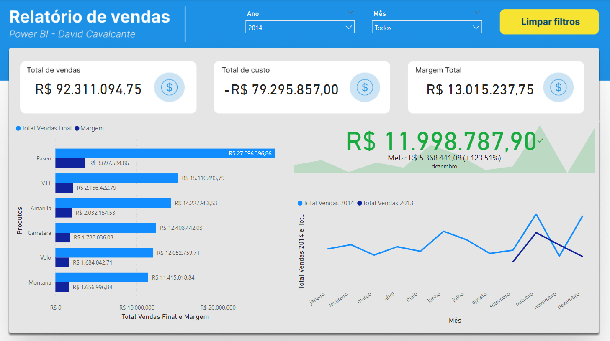

# Relatório de Vendas - Power BI



## Descrição

Este projeto é um relatório de vendas desenvolvido em Power BI por David Cavalcante. O dashboard fornece uma visão abrangente das vendas totais, custos e margens, além de uma análise detalhada por produto e por mês.

## Visão Geral do Dashboard

- **Total de Vendas**: R$ 92.311.094,75
- **Total de Custo**: -R$ 79.295.857,00
- **Margem Total**: R$ 13.015.237,75
- **Análise Mensal e Anual das Vendas**

## Funcionalidades

- Filtros por ano e mês para uma análise personalizada.
- Gráficos de barras e linhas para visualização clara dos dados.
- Comparação das vendas de 2013 e 2014.
- Meta de vendas e desempenho mensal.

## Pré-requisitos

- [Power BI Desktop](https://powerbi.microsoft.com/desktop/)
- Conjunto de dados de vendas

## Instalação

1. Clone este repositório em sua máquina local:
    ```bash
    git clone https://github.com/David-Cavalcante/Projetos-Power-BI
    ```
2. Abra o Power BI Desktop.
3. Importe o arquivo `.pbix` incluído no repositório.

## Uso

1. Carregue seus dados de vendas no Power BI.
2. Utilize os filtros para ajustar a visualização conforme necessário.
3. Analise os gráficos e métricas para obter insights sobre o desempenho de vendas.

## Demonstração

Aqui está uma imagem do dashboard criado:


## Contribuição

Sinta-se à vontade para contribuir com este projeto. Para isso, siga os passos abaixo:

1. Faça um fork deste repositório.
2. Crie uma nova branch:
    ```bash
    git checkout -b feature/nova-funcionalidade
    ```
3. Faça suas modificações e commite:
    ```bash
    git commit -m 'Adiciona nova funcionalidade'
    ```
4. Envie para a branch original:
    ```bash
    git push origin feature/nova-funcionalidade
    ```
5. Crie um Pull Request.

## Licença

Este projeto está licenciado sob a Licença MIT - veja o arquivo [LICENSE](LICENSE) para mais detalhes.

## Contato

David Cavalcante - [LinkedIn](https://www.linkedin.com/in/davidcavalcante)

---

Para mais detalhes, visite o [projeto original](http://bit.ly/45UUGES).
